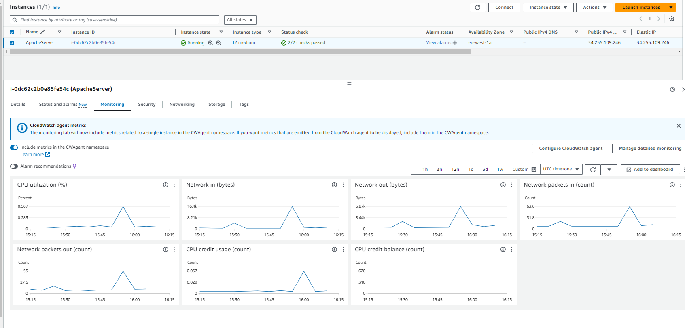

# :star: Quick reference
* **Maintained by:** Firewall Force - Project
* **Developed by:**
- Jhonny Alexander Gómez
- Anades Pacheco
- Sergi Castillo
- Juan Andrés Esparragoso

---

### :sparkler: <u>Descripción</u>
El siguiente repositorio se ha realizado con fines educativos para la elaboración del proyecto final propuesto por la academia online **Keepcoding** en el bootcamp **DEVOPS AND CLOUD COMPUTING**.

**NOTAS IMPORTANTES:**
1. Se utilizó **Digital Ocean** para desplegar el clúster de K8S.
2. Se utilizó **Vagrant** para desplegar máquinas en el entorno local.
3. Se utilizó **PHPUNIT** para test unitarios (sólo se realizan tests unitarios).
4. Se utilizó un **Chart de Helm** para aplicar los manifiestos.
5. Los requisitos indispensables para el despliegue es tener instalado en la máquina local tanto **Vagrant** como **Virtualbox**.

 

---

## :sparkler: <u>¿Cómo ejecutar la práctica?</u>
Para ejecutar la práctica tenemos que seguir los pasos descritos a continuación:
 

## Despliegue de PRE
### <u>Levantar el entorno en local</u>
 

1. **Clonar el repositorio con nuestro entorno**

Clonamos el repositorio que levantará el entorno en local.

~~~
git clone https://github.com/FirewallForce/kc-vagrant-local-dev.git
~~~

2. **Levantar la máquina de Vagrant**

Ejecutamos el siguiente comando para levantar las máquinas del entorno local.

~~~
vagrant up
~~~ 

3. **Levantar ArgoCD**

Ejecutamos el siguiente comando para levantar ArgoCD.

~~~ 
kubectl argo rollouts dashboard
~~~

Accedemos a la URL de ArgoCD a través de http://localhost:3100

4. **Acceder a la terminal de Vagrant**

Accedemos al interior de la máquina que hemos levantado en el entorno local:

~~~
vagrant ssh
~~~

5. **Entorno local levantado**

Ahora tenemos levantado un entorno web al que se puede acceder desde la siguiente URL => https://localhost:8040

6. **Cambios en la plantilla web**

Una vez conectados a la máquina accedemos a la ruta "/var/www/develop/" para, una vez ahí, cambiar a la rama **develop** con el comando:

~~~
sudo git branch develop
~~~

y acceder a la carpeta "src" donde se encuentra el archivo **index.php** que aloja la página web y que, a continuación, vamos a editar alguna parte del mismo.

 

Una vez hecho esto, guardamos los cambios en el archivo y hacemos el commit para subir los cambios realizados al repositorio con los siguientes comandos:

~~~
git add .
git commit -m "mensaje_a_elegir"
git push
~~~

 

7. **Despliegue en CircleCI**

Una vez que se han pusheado los cambios al repositorio, se lanza automáticamente un pipeline en **CircleCI** que ejecuta las siguientes tareas:

- Escaneo de **GitGuardian**: realiza un escaneo tanto de los repositorios como de la imagen de docker implicada en el proceso.
- **Linter**: realiza un escaneo mediante el uso de **LINT**.
- **Tests unitarios**: realiza test unitarios, usando para ello **PHPUNIT** que es utilizado para PHP.
- Actualización de chart de helm: realizar una actualización del chart de helm que mantiene el clúster de K8S, aquí se actualiza el manifiesto **deployment.yaml**, modificando la versión de la imagen que posteriormente será desplegada.
- Construcción de la imagen de docker y su publicación en DockerHub: realiza la construcción de la imagen y la sube al registro de **Dockerhub** para su posterior despliegue en el clúster de **Digital Ocean**.
- Despliegue en el entorno de **PRE**: se realiza el despliegue de la imagen actualizada en el clúster de **Digital Ocean** utilizando para ello **ArgoCD**.

8. **Dominio levantado**

Se ha utilizado para el clúster Digital Ocean y como dominio **yotkt.com** por lo que es posible acceder a este dominio a través de un navegador utilizando la siguiente URL => [http://yotkt.com](http://yotkt.com).

En este momento, está lanzado y funcionando el entorno de **PRE**. A partir de ahora veremos cómo se despliega el entorno de **PRO**.
#### [VOLVER ARRIBA](#top)

## Despliegue de PRO
9. **Creación de pull request**

Una vez realizados los pasos anteriores, creamos una pull request, se acepta y se mergea para aplicar los cambios a la rama principal.

10. **Ejecución de pipeline**

Cuando se han mergeado los cambios, se dispara un nuevo pipeline que su función únicamente será desplegar el entorno de **PRO**.

 

En cuanto ha terminado de realizar el despliegue del entorno de **PRO**, la imagen de este entorno es subida a **Packagist**.

#### [VOLVER ARRIBA](#top)

 

## Website en Terraform
Esta infraestructura se desplegó en la nube de **AWS** utilizando **terraform** y se está sirviendo una aplicación web, la cual es accesible para los usuarios finales a través de un endpoint resolviendo un registro A del DNS:34.255.109.246.

Se han usado 3 comandos básicos de terraform que son los siguientes:
- terraform **plan**: se utiliza para crear un plan de ejecución, que muestra lo que Terraform planea hacer antes de que se hagan cambios reales en la infraestructura.
- terraform **apply**: aplica los cambios definidos en Terraform para alcanzar el estado deseado de la infraestructura.
- terraform **destroy**: elimina la infraestructura gestionada por Terraform, deshaciendo los cambios aplicados.

## :sparkler: <u>Recursos Desplegados a nivel de Red</u>	
1. **Network VPC (Virtual Private Cloud):** este bloque define una VPC con un bloque CIDR de 10.0.0.0/16, proporcionando un espacio de direcciones privadas grande dentro del cual se pueden colocar subredes y otros recursos de red.

2. **Subnet:** este bloque configura una subred dentro de la VPC creada anteriormente. Usa un bloque CIDR más específico (10.0.0.0/24) y está localizada en la zona de disponibilidad **eu-west-1a**. La opción "map_public_ip_on_launch = true" indica que las instancias lanzadas en esta subred recibirán automáticamente una dirección IP pública.

3. **Security Group:** este bloque crea un grupo de seguridad dentro de la VPC que permite tráfico saliente hacia cualquier destino y tráfico entrante en los puertos 22, 80, y 443 desde cualquier lugar.

4. **Internet Gateway:** define una puerta de enlace de Internet y la asocia con la VPC. Esta puerta de enlace permite la comunicación entre la VPC e internet.

5. **Route Table y Route Table Association:** estos bloques configuran una tabla de enrutamiento que define una ruta por defecto hacia el Internet Gateway para el tráfico destinado a direcciones fuera de la VPC. Además, asocia esta tabla de enrutamiento con la subred creada anteriormente convirtiéndola en una subred pública.

----

## :sparkler: <u>Recursos Desplegados a nivel de EC2</u>
Los recursos que han sido desplegados a nivel de EC2 son los siguientes:

1. **Key Pair para SSH:** este bloque crea un par de claves en AWS, donde **key_name** es el nombre asignado al par de claves, y **public_key** carga el contenido de tu clave pública SSH desde tu máquina local. Esto permite el acceso SSH seguro a las instancias EC2 creadas en AWS que utilicen este par de claves.

2. **Instancia EC2 con Apache:** este bloque define una instancia EC2 que utilizará una AMI específica (que debe ser relevante para la región en la que se esté trabajando) y será del tipo **t2.medium**. La instancia usará el par de claves SSH creado, estará ubicada en la subred y grupo de seguridad especificados. El bloque user_data contiene un script que se ejecuta en el primer inicio de la instancia para:
- Actualizar los paquetes del sistema.
- Instalar y configurar el servidor web Apache.
- Instalar Certbot y configurar una prueba de renovación automática de certificados SSL, lo cual es útil para configurar HTTPS.

3. **Dirección IP Pública Estática (Elastic IP):** este bloque crea y asigna una dirección IP pública estática (Elastic IP) a la instancia EC2. Esto garantiza que la dirección IP de la instancia no cambiará a través de reinicios de la máquina, lo cual es importante para el acceso a través de Internet y para servicios que dependen de la IP.

---

### :sparkler: <u>Como desplegar la infraestructura</u>
#### <u>Mediante Terraform</u>
Partimos de que se debe tener instalado Terraform y Visual Studio Code.

Si no se tiene instalado se deberán realizar las instalaciones correspondientes. A continuación, se muestran los enlaces donde se podrán encontrar las páginas de descarga:
- [Descarga e instalación de Terraform](https://developer.hashicorp.com/terraform/install)
- [Descarga e instalación de Visual Studio Code](https://code.visualstudio.com/download)

---

### :sparkler: <u>Ejecución en Windows</u>
Accedemos a la carpeta de nuestro PC local donde deseemos mantener el proyecto y clonamos el repositorio:
~~~
cd C:\
 git clone https://github.com/FirewallForce/kc-terraform 
~~~

Inicializar los proveedores y todo lo necesario para la ejecución de terraform:
~~~
terraform init
~~~

Para poder observar qué acciones llevará a cabo terraform:
~~~
terraform plan
~~~

Para que se ejecute el plan anterior y no pida confirmación:
~~~
terraform apply -auto-approve
~~~

Finalmente se destruye la infraestructura para evitar costes innecesarios, evitando la confirmación:
~~~
terraform destroy -auto-approve
~~~

----

### :sparkler: <u>Output</u>
**Esta es la URL del proyecto:**
Output: "https://jhonalex.com/"

----

## :sparkler:<u>Funciones de Monitoreo y Gestión</u>
- **Uso de CPU (% de utilización):** muestra picos de actividad, indicando posiblemente la ejecución de tareas que consumen recursos o el tráfico a la instancia.
- **Tráfico de Red (Network In/Out en bytes):** indica la cantidad de datos entrantes y salientes, útil para entender la cantidad de tráfico que maneja la instancia.
- **Paquetes de Red (Network packets in/out count):** número de paquetes enviados y recibidos que da una idea sobre la conectividad de red y el tráfico.
- **Uso de los Créditos de CPU:** hay dos métricas visibles, una muestra el uso de créditos de CPU y, la otra, el balance de créditos de CPU, que es crucial para entender cómo la instancia está manejando su capacidad computacional y si podría estar sujetando a throttling.

---

## :sparkler: <u>EC2 & Cloudwash</u>

 

#### [VOLVER ARRIBA](#top)

 

## Monitorización
Para la monitorización del proyecto se ha hecho uso de **Prometheus** y **Grafana**.
Todas las alertas que se han configurado se envían a un canal en **Slack** donde se señala dónde y cuál es la incidencia producida.

Las alertas configuradas son por un uso alto de memoria y por un uso alto de CPU y salta una nueva alerta cada x tiempo que también está configurado.

 

El endpoint que está configurado en Prometheus hace referencia a la página http://yotkt.com/metrics
Seleccionando una de las métricas que se encuentra dentro de esta URL podemos consultarla dentro de Prometheus y ver una gráfica de dicha métrica.

 

Para la visualización de todas las gráficas en Grafana hacemos un "import" de un json en el que se encuentran los gráficos customizados.
Una vez que se ha importado este json, veremos las 4 métricas que se muestran en la URL anteriormente mencionada.

### <u>Registros implicados</u>
Durante el proceso se han visto implicados los siguientes registros:

1. **PACKAGIST**
Se ha usado packagist como gestor de paquetes para conseguir la gestión de paquetes en PHP.

2. **DOCKERHUB**
Se ha usado dockerhub, para almacenar la imagen de docker que sería actualizada y posteriormente desplegada en el clúster.

3. **GIT GUARDIAN**
Se ha usado Git Guardian para el escaneo tanto de repositorios como de la imagen construida de Docker y publicada en Dockerhub.

4. **ARGOCD**
Se ha usado ArgoCD para realizar el despliegue de la imagen de la aplicación en el clúster de Digital Ocean.

#### [VOLVER ARRIBA](#top)

## Repositorios del proyecto

- **[Aplicación web PHP](https://github.com/FirewallForce/kc-web-app-php)**
- **[Chart](https://github.com/FirewallForce/kc-helm-chart-app)**
- **[Monitoreo](https://github.com/FirewallForce/kc-monitoring)**
- **[Terraform](https://github.com/FirewallForce/kc-terraform)**
- **[Máquina local Vagrant](https://github.com/FirewallForce/kc-vagrant-local-dev)**

#### [VOLVER ARRIBA](#top)